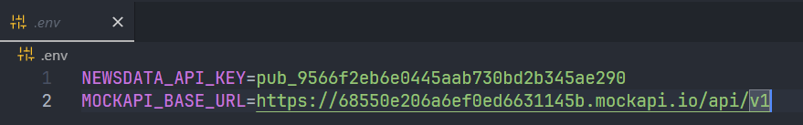

# Kelompok 2 Praktikum Mobile
# OwlPress
> [!NOTE]
Informatika B 2022  
Zefri Fahlevi Irdiansyah `(2206068)`  
Dindin Mardiana `(2206037)`  
Muhammad Rais Alghany Dermawan `(2206057)`  
Moch Nashrull Maulana Fazri `(2206058)`  
Sarah Nurlatifa `(2206156)`
>

Desain UI/UX Prototype `https://www.figma.com/design/nyxgZrAEsDoBO9HSaD3RcQ/Prak-Mobile-UI?node-id=0-1&p=f`

## Tahap Instalasi
1. Jika sudah melakukan `git clone https://github.com/zefrifahlevi/owlpress.git`
2. Buat file .env dalam projek
3. Lalu masukan API berikut, kedalam file .env
- `NEWSDATA_API_KEY=pub_9566f2eb6e0445aab730bd2b345ae290`
- `MOCKAPI_BASE_URL=https://68550e206a6ef0ed6631145b.mockapi.io/api/v1`
4. Selanjutnya lakukan Download Packages di pubspec.yaml, atau dengan perintah `flutter pub get`
5. Setelah itu anda bisa melakukan Run Project Flutter ini

- Membuat File .env

- Memasukan API ke dalam file .env
